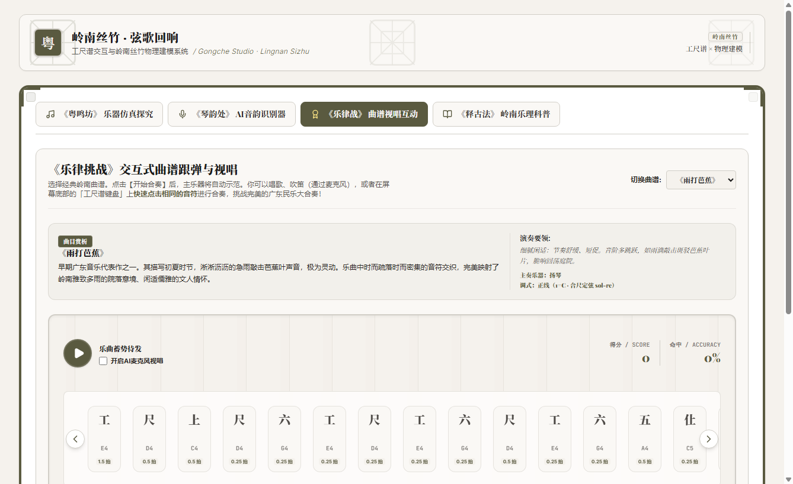

# 岭南丝竹 · Gongche Studio

**用纯 Web Audio 物理建模复原岭南丝竹，让古老的工尺谱可听、可玩、可识唱。**
A zero-sample, physics-based Cantonese traditional music studio — synthesize the Gaohu (高胡), Yangqin (扬琴) and Chaozhou Zheng (潮州筝), and bring the Gongche notation (工尺谱) to life in the browser.

[](LICENSE)


> 🚀 **在线 Demo**：推送到 GitHub 并在仓库 **Settings → Pages → Source: GitHub Actions** 后，将由 `.github/workflows/deploy.yml` 自动发布到 `https://<你的用户名>.github.io/lingnan-sizhu-studio/`。在此之前可本地 `npm run dev` 立即体验。

---

## ✨ 功能特性

整套系统由四个模块构成"听 — 辨 — 谱 — 奏"的完整闭环：

| 模块 | 名称 | 你可以做什么 |
|---|---|---|
| 🪕 **粤鸣坊** | 乐器仿真探究 | 在工尺音位上点奏高胡 / 扬琴 / 潮州筝，音色全部由物理模型实时合成 |
| 🎙️ **琴韵处** | 音韵识别器 | 对着麦克风哼唱/拉奏，实时识别音高并换算、显示为工尺字，绘制音高曲线 |
| 🏆 **乐律战** | 曲谱视唱互动 | 跟随《雨打芭蕉》《步步高》《彩云追月》的工尺谱，用键盘或麦克风跟弹视唱并获得准确率评分 |
| 📖 **释古法** | 岭南乐理科普 | 交互式对照工尺谱、潮州二四谱与正线 / 反线 / 乙反 / 活五调式，逐音试听 |





---

## 🎵 它是如何发声的：零采样物理建模

与常见的"加载采样音频"不同，本项目**不包含任何乐器录音素材**，所有声音都从声学模型合成，源码集中在 [`src/utils/audioSynth.ts`](src/utils/audioSynth.ts)：

- **扬琴 / 潮州筝 —— 改进型 Karplus-Strong 数字波导弦振**
  分数延迟（fractional delay）实现精确律制；环路低通模拟弦的能量耗散；与周期相关的衰减系数还原"亮—闷"的自然变化；叠加击弦 / 拨弦瞬态。音符离线渲染为 `AudioBuffer` 并缓存，零运行时分配。
- **高胡 —— 弓弦乐器谐波合成**
  `PeriodicWave` 谐波谱构建声源，循环滤波粉噪模拟弓毛摩擦噪声，琴筒 / 蟒皮以一组峰值滤波器（共振峰）建模；支持连弓换把滑音、延迟启动的揉弦（吟音）与平稳自然的收弓。
- **空间 —— 卷积混响与总线压缩**
  指数衰减噪声 + 颤动回声（chow）程序化生成厅堂脉冲响应（IR），对干声做卷积得到岭南厅堂的空间感；总线压缩保证多音齐发不削波。
- **麦克风识谱 —— 时域自相关基频检测**
  [`src/utils/pitchDetector.ts`](src/utils/pitchDetector.ts) 用归一化自相关（ACF2+）估计基频，再按当前调式（正线 1=C / 乙反等）映射到工尺字。

---

## 🚀 快速开始

环境要求：**Node.js 20 LTS 及以上**。无需任何 API Key、无需后端服务。

```bash
# 安装依赖
npm install

# 启动网页开发服务器（http://localhost:3000）
npm run dev

# 生产构建（输出到 dist/，base 为相对路径，可托管到任意静态平台）
npm run build
npm run preview

# 类型检查
npm run typecheck
```

### 打包为 Windows 桌面应用（Electron）

```bash
npm run dist
# 产物：release-final/LingnanSizhuStudio-1.0.0.exe（单文件便携版）
```

### 部署为在线网页

构建产物是纯静态文件，`vite.config.ts` 已设置 `base: './'`，可直接部署到 **GitHub Pages / Vercel / Cloudflare Pages**。仓库已内置 GitHub Pages 工作流（`.github/workflows/deploy.yml`），推送 `main` 分支即自动构建发布。

---

## 📁 项目结构

```
lingnan-sizhu-studio/
├── index.html                     # 页面入口与 meta
├── main.js                        # Electron 主进程
├── electron-builder.yml           # 桌面打包配置
├── vite.config.ts                 # Vite + React + Tailwind，相对 base
├── public/                        # favicon（满洲窗 + 工尺“尺”字）
├── src/
│   ├── App.tsx                    # 应用骨架、四模块导航、音频激活
│   ├── index.css                  # 满洲窗 / 宣纸主题（Tailwind CSS v4）
│   ├── types.ts
│   ├── data/musicData.ts          # 工尺谱 / 二四谱 / 调式 / 曲目领域数据
│   ├── utils/
│   │   ├── audioSynth.ts          # 物理建模音频引擎（波导 / 弓弦 / 卷积混响）
│   │   └── pitchDetector.ts       # 自相关基频检测
│   └── components/
│       ├── InstrumentWorkshop.tsx   # 粤鸣坊
│       ├── PitchDetectorConsole.tsx # 琴韵处
│       ├── GameChallenge.tsx        # 乐律战
│       ├── MusicTheoryAtlas.tsx     # 释古法
│       └── ManchurianWindow.tsx     # 满洲窗主题框架
└── docs/
    └── OPEN_SOURCE_PLAN.md        # 开源优化策略与路线图
```

---

## 🎼 工尺谱与岭南乐理

工尺谱是中国传统记谱法之一，以"合、四、一、上、尺、工、凡、六、五、乙"记音；潮州筝乐另有"二四谱"，并以轻六、重六、活五等调式表达不同情绪。本项目把这些口传心授的知识结构化为可计算的音位与调式数据，并据此校正了高胡定弦（G4–D5）、三首曲目的调式与配器：

- 《雨打芭蕉》—— 正线，扬琴 / 筝
- 《步步高》（《薪传步步高》）—— 正线，高胡软弓三件头
- 《彩云追月》—— 羽调（1=D）

**乐理参考与鸣谢**（公开资料）：

- 高胡形制与定弦：[百科·高胡](https://m.baike.com/wiki/%E9%AB%98%E8%83%A1/11768087)、[上海音乐学院东方乐器博物馆](https://bowuguan.shcmusic.edu.cn/2025/1027/c549a59170/pagem.htm)
- 广东音乐三调与江南丝竹：[广东音乐与江南丝竹教学参考（香港教育局）PDF](https://www.edb.gov.hk/attachment/tc/curriculum-development/kla/arts-edu/resources/mus-curri/guangdongyinyue-jiangnan-sizhu-c.pdf)
- 潮州二四谱：[潮州市文化馆](https://www.gdczwhg.cn/portal1/category/read?id=825&nid=67)
- 《彩云追月》曲谱：[国家中小学智慧教育平台 PDF](https://r3-ndr.ykt.cbern.com.cn/edu_product/esp/assets_document/a33b345c-b2b1-4d7e-896c-9c74c0b1c4bc.pkg/pdf.pdf)
- 广东音乐"软弓三件头"：[广州大学广府文化基地](https://gzgfwh.gzhu.edu.cn/info/1042/1347.htm)、[光明日报](http://www.gmw.cn/01gmrb/2005-08/05/content_284035.htm)

---

## 🗺️ 路线图

详见 [`docs/OPEN_SOURCE_PLAN.md`](docs/OPEN_SOURCE_PLAN.md)。后续重点：TypeScript 严格模式与 ESLint、把乐理 / 声学断言沉淀为仓库内自动化测试与 CI、音频引擎架构文档、响应式与新手引导、更多乐器与曲目。

---

## 🤝 参与贡献

欢迎 Issue 与 PR：乐器音色改进、曲谱与乐理勘误、新乐器 / 新曲目、代码质量与文档都在欢迎之列。提交前请运行 `npm run typecheck` 与 `npm run build`。

---

## 📄 许可证

[MIT License](LICENSE) —— Copyright (c) 2026 **Molo**。

界面视觉灵感来自岭南满洲窗套色玻璃与传统宣纸；乐理内容整理自上述公开资料。感谢 React、Vite、Tailwind CSS、Electron、Motion 与 lucide-react 等开源项目。
