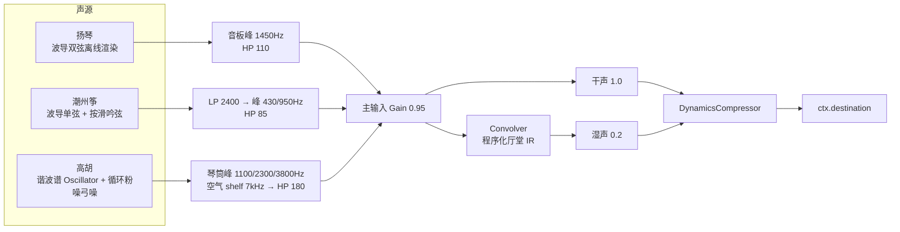

# 音频引擎架构

「岭南丝竹 · Gongche Studio」的音色**不依赖任何采样音频**，三件乐器全部由 Web Audio API
实时物理建模合成。本文记录信号链路、关键参数与设计取舍，便于复核听感、调参与二次开发。

- 科普长文（建模选型与“高胡为何不用波导”）：[物理建模技术文章](./PHYSICAL_MODELING.md)
- 源码：[`src/utils/audioSynth.ts`](../src/utils/audioSynth.ts)
- 音高检测：[`src/utils/pitchDetector.ts`](../src/utils/pitchDetector.ts)
- 乐理数据：[`src/data/musicData.ts`](../src/data/musicData.ts)
- 回归测试：[`test/`](../test)

## 1. 设计原则

1. **零采样、纯合成**：不加载任何 `.wav/.mp3` 音色库，声音由算法生成，产物体积极小且无版权风险。
2. **弹拨用波导，弓弦用谐波 + 弓噪**：拨弦/击弦是"激励后自由衰减"，天然适合 Karplus-Strong
   数字波导；拉弦是"持续受迫振动 + 弓毛摩擦"，更适合谐波谱声源叠加随机弓噪（见 [§6](#6-为什么高胡不直接用-karplus-strong)）。
3. **离线确定性渲染**：波导部分是接收采样率、返回 `Float32Array` 的**纯函数**，带随机种子，
   因此可在 Node 中离线渲染、断言并缓存为 `AudioBuffer`。
4. **增强而非滤除**：琴体共鸣一律用 `peaking`/`highshelf` 峰化叠加，不用宽带 `bandpass` 砍掉泛音，
   这是高胡不"发闷"的关键。

## 2. 信号流总览



## 3. 弹拨弦鸣：改进型 Karplus-Strong 波导

核心函数 `renderPluckedString(sampleRate, frequency, options)`，在一条（扬琴为两条）环形延迟线上
模拟弦振动：

1. **激励**：用一个基频周期长度的低通滤波噪声填充延迟线，归一化后模拟拨弦/击弦瞬间弦的位移形状。
2. **分数延迟读取 + 线性插值**：读指针滞后写指针 `N = fs/f` 个采样，支持延迟长度随时间连续变化
   （吟弦、按滑的动态音高因此不失真）。
3. **环路一阶低通**：`y = (1-d)·x + d·x_prev`，系数随时间缓慢增大，模拟"高频先死"的自然变暗。
4. **按周期计的 T60 衰减补偿**：信号每绕延迟线一圈恰为一个振动周期，故衰减系数按周期施加，
   并补偿环路低通在基频处的增益损失，使各音高的余音时长精确符合 `t60 ∝ 1/f`（低频余音更长）。
5. **同度多弦微失谐**：扬琴每音两条弦，分别 ±4 音分，叠加后产生缓慢的合唱感（beatings）。
6. **击/拨弦瞬态**：起音叠加极短宽带噪声（琴竹/指甲接触）与高频正弦 ping（金属光泽）。
7. **峰值归一**到目标电平，mulberry32 种子保证同参数结果逐采样一致。

### 3.1 扬琴与潮州筝参数对照

| 参数 | 扬琴（琴竹击弦） | 潮州筝（指甲拨弦） |
|---|---|---|
| 同度弦数 | 2（失谐 ±4 cents） | 1 |
| 渲染时长 | 2.6 s | 3.8 s |
| 激励低通系数（越大越暗） | 0.22（明亮） | 0.50（柔和） |
| 环路阻尼 / 时变增量 | 0.415 / 0.05 | 0.485 / 0.012 |
| T60（基准 440Hz） | 0.95 s | 1.6 s |
| 击弦噪声 | 16 ms · 增益 0.35 | 10 ms · 增益 0.16 |
| 高频 ping | 5.6f / 8.2f · 0.12 · 8ms | 6.5f · 0.07 · 6ms |
| 播放电平 | 0.50 | 0.55 |
| 琴体滤波链 | 峰 1450Hz +3dB → HP 110 | LP 2400 → 峰 430Hz +3.5dB → 峰 950Hz +2dB → HP 85 |

### 3.2 潮州筝"以韵补声"的音高包络

`zhengPitchEnvelope(bend)` 用一条动态音高曲线（单位：音分）复刻左手作韵：

- **张力沉降**：起音 +18 音分、约 35ms 回落；
- **按滑**：100ms 后以 130ms 时常平滑压向目标，活五调最深达 **1.5 半音**；
- **延迟吟弦**：150ms 后渐入 4.6Hz 揉弦，350ms 达到全幅，按音越深颤幅越大（16–26 音分）。

### 3.3 AudioBuffer 缓存

弹拨结果按 `乐器:频率:采样率`（筝额外含按滑量，量化到 1/4 半音）缓存为 `AudioBuffer`，
同音复用，避免重复的波导计算。

## 4. 弓弦：高胡

高胡是持续音乐器，一声弓（`GaohuVoice`）承载整段连弓旋律。

### 4.1 声源：钢弦谐波谱

`PeriodicWave` 直接给定 13 个谐波幅度，基频与 2–6 次谐波都很强、高次缓慢衰减，
对应钢弦、小琴筒、紧蟒皮的明亮频谱：

```
1, .78, .62, .5, .4, .3, .22, .15, .1, .065, .04, .025, .015
```

### 4.2 弓毛摩擦声

2 秒**循环粉噪**（Paul Kellett 滤波器，全局只生成一次）→ 高通 900Hz →
中心频率跟踪 `2.6 × 基频` 的带通（Q 0.7）→ 弓噪增益。起弓瞬间 0.05、100ms 内落到 0.012；
连弓换把时仅 0.025 一闪——弓噪只提供擦弦质感，不主导音色。

### 4.3 琴筒共振峰（只增强不滤除）

琴弦声与弓噪并联后依次通过：

| 节点 | 类型 | 参数 | 作用 |
|---|---|---|---|
| body1 | peaking | 1100Hz · Q2 · +4dB | 琴筒/蟒皮主共鸣 |
| body2 | peaking | 2300Hz · Q2.5 · +3dB | 明亮中频 |
| body3 | peaking | 3800Hz · Q3 · +2.2dB | 钢弦穿透感 |
| air | highshelf | 7000Hz · +2.5dB | 高频空气光泽 |
| hpf | highpass | 180Hz | 去除不属于高胡的低频浑浊 |

### 4.4 连贯性与韵味

- **连弓复用**：再次触发时若有正在发声的 voice，不重新起弓，而是对主振荡器、弓噪带通做
  75ms 指数滑音，弓压用 `setTargetAtTime` 平稳保持——音与音之间是一条歌唱性线条，无音量断崖。
- **起弓绰音**：仅自下方 0.35 半音、55ms 内快速贴住准音高，保留粤胡韵味又不发"偏低"。
- **广东风格延迟吟音**：起弓 120ms 后才开始 5.2Hz 揉弦，380ms 达到全幅（约 ±20 音分），
  对称波动不产生系统性音高偏移。
- **自然收弓**：末音结束后先平稳延续 150ms，再以约 110ms 指数淡出，340ms 后停止并释放节点。
- 输出电平 0.16，起音 50ms 线性淡入（模拟弓子起速）。

## 5. 主总线：卷积混响 + 总线压缩

- **程序化厅堂脉冲响应**：2.8s 立体声，左右各 5 个不同时刻的早期反射
  （L 13/27/41/59/81ms，R 17/31/46/64/86ms，幅度按 0.7 递减），18ms 后接 τ≈0.8s 的指数衰减噪声尾。
- **并行干湿声**：干声增益 1.0，卷积湿声 0.2（室内乐厅堂感，湿声不过重）。
- **总线压缩**：threshold −15dB、knee 14、ratio 3、attack 5ms、release 250ms，
  粘合多件乐器并防止削顶。

## 6. 为什么高胡不直接用 Karplus-Strong

Karplus-Strong 的本质是"一次性激励 + 延迟线自由衰减"，擅长衰减型的弹拨音；而高胡是弓毛持续
激励、音量近乎不衰减的弓弦音，朴素波导无法自然表达持续弓压、弓噪与一弓多音的连弓换把。
因此高胡改用"谐波谱声源 + 随机弓噪 + 共振峰整形"，并用 voice 复用与指数滑音实现连贯线条。
弹拨乐器则保留波导，因为它对拨弦的衰减、泛音演化与失谐合唱的建模最直接、计算也最轻。

## 7. 音高检测与乐理映射

`autoCorrelate(buffer, sampleRate)`：

1. RMS 门限（0.008）判断是否有声音；
2. 计算自相关序列，找到过零后的主峰得到周期 `T0`；
3. 对峰值做**抛物线插值**获得亚采样精度，输出基频（有效范围约 65–1200Hz）。

`getGongcheFromFrequency(freq, mode)` 把基频映射到最近的工尺字，并给出音分偏差与置信度。
支持两套调式（[`pitchDetector.ts`](../src/utils/pitchDetector.ts)）：

- **正线 1=C**（合=G，高胡合尺定弦 sol-re）；
- **D 宫羽调 1=D**（合=A，潮州筝定弦 /《彩云追月》）。

## 8. 测试策略

测试运行在 Node（`vitest`），不需要浏览器或 Web Audio mock：

- [`test/theory.test.ts`](../test/theory.test.ts)：十二平均律、两套工尺表、三首曲目逐音
  工尺标注、乐器音域与定弦序列、旋律骨干——锁定乐理正确性。
- [`test/acoustic.test.ts`](../test/acoustic.test.ts)：
  - 扬琴/潮州筝**直接调用引擎波导纯函数**，断言无 NaN、峰值电平、自然衰减（尾/头 RMS 比 < 2%）、
    基频误差 < 2.5%、活五按滑约 1.5 半音；
  - 高胡浏览器端基于 Web Audio 节点无法在 Node 渲染，故用
    [`test/helpers/offline-dsp.ts`](../test/helpers/offline-dsp.ts) 中**数学等价的离线复刻**
    （同样的谐波谱、弓噪滤波、共振峰 RBJ 系数与滑音/包络时序），锁定基频、连弓滑音连续性与电平。

## 9. 关键参数速查

| 项 | 值 |
|---|---|
| 主输入 / 干 / 湿增益 | 0.95 / 1.0 / 0.2 |
| 压缩器 | −15dB · knee14 · 3:1 · atk5ms · rel250ms |
| 混响 IR 时长 / 噪声尾 τ | 2.8s / 0.8s |
| 高胡输出电平 / 主振荡器增益 | 0.16 / 0.72 |
| 高胡揉弦 | 5.2Hz，延迟 120ms，±约 20 cents |
| 高胡连弓滑音 / 起弓绰音 | 75ms 指数 / −0.35 半音 · 55ms |
| 高胡琴筒共振峰 | 1100 / 2300 / 3800 Hz（+4 / +3 / +2.2 dB） |
| 音高检测 RMS 门限 / 频率范围 | 0.008 / 65–1200 Hz |
