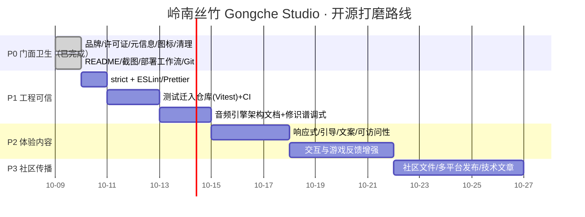

# 开源优化策略与路线图

> 目标：把《岭南丝竹 · Gongche Studio》打磨成一个**敢公开、看得懂、跑得起来、值得 Star**的 GitHub 展示项目。
> 本文记录产品定位、差距清单、分阶段路线图与验收标准。**P0（开源门面）已于 2026-10-09 完成**，P1–P3 为后续规划。

---

## 一、一页纸结论（TL;DR）

这是一个**选题稀缺、技术有真东西、视觉有辨识度**的项目，具备优质开源项目的底子。

- **产品定名**：岭南丝竹 · Gongche Studio（仓库 slug：`lingnan-sizhu-studio`）。
- **许可证 / 署名**：MIT License，版权人 **Molo**；仓库内不含任何学校、课程作业或个人学籍信息。
- **核心卖点**：不用任何采样音频，纯手写 Web Audio 物理建模复原岭南"软弓三件头"（高胡 / 扬琴 / 潮州筝），并把工尺谱做成**可听、可玩、可麦克风识谱**的活系统。
- **策略**：**P0 门面卫生（已完成）→ P1 工程可信 → P2 体验内容 → P3 社区传播**。
- **明确取舍**：不接大模型、不做专业制谱软件、不贪多乐器，聚焦"岭南三乐器 + 工尺谱教学/游戏"这一个讲得透的故事。

---

## 二、产品现状盘点

### 2.1 它是什么

一个 Electron + Web 单页应用，纯前端、无后端、无外部 API 依赖即可运行。四个模块构成完整闭环：

| 模块 | 名称 | 能力 | 主要源文件 |
|---|---|---|---|
| 粤鸣坊 | 乐器仿真探究 | 高胡 / 扬琴 / 潮州筝三乐器，点击工尺音位即发物理建模音色 | `InstrumentWorkshop.tsx` |
| 琴韵处 | 音韵识别器 | 麦克风实时测音高（自相关算法），换算并显示工尺字、绘制音高曲线 | `PitchDetectorConsole.tsx`、`pitchDetector.ts` |
| 乐律战 | 曲谱视唱互动 | 《雨打芭蕉》《步步高》《彩云追月》工尺谱跟弹/视唱，键盘或麦克风输入、准确率评分 | `GameChallenge.tsx`、`musicData.ts` |
| 释古法 | 岭南乐理科普 | 工尺谱、二四谱、正线/反线/乙反/活五调式的交互式对照与试听 | `MusicTheoryAtlas.tsx` |

### 2.2 技术栈与规模

- Electron 42 + React 19 + TypeScript 5.8 + Vite 6 + Tailwind CSS 4 + Motion + lucide-react。
- 源码约 **2400 行 / 10 个核心文件**，精悍、可读完。
- 核心引擎 `src/utils/audioSynth.ts`：
  - 扬琴 / 潮州筝：**Karplus-Strong 改进型数字波导**（分数延迟 + 环路低通 + 周期衰减 + 击/拨弦瞬态），离线渲染 `AudioBuffer` 并缓存；
  - 高胡：**谐波谱声源 + 循环粉噪弓噪 + 琴筒/蟒皮共振峰组**，支持连弓换把滑音、延迟揉弦、自然收弓；
  - 程序化厅堂脉冲响应**卷积混响** + 总线压缩。
- 视觉：满洲窗主题框架 + 宣纸米白 / 橄榄绿配色，文化辨识度明确。

### 2.3 技术资产（开源叙事的弹药）

1. **零采样的民族乐器物理建模**：全部从声学方程合成，DSP 代码自包含、可读。
2. **工尺谱 / 二四谱的数字化建模**：把口传心授的乐理变成频率、音位、调式可计算的数据结构。
3. **经过考证的内容正确性**：工尺谱音位、高胡定弦（G4–D5）、曲目调式与配器均核对过权威公开来源，并沉淀了数百项乐理 / 声学断言（待随 P1 迁入仓库）。
4. **麦克风实时识谱**：自相关基频检测 + 按调式映射工尺字，形成"听—辨—谱—奏"闭环。

---

## 三、产品定位与开源叙事

### 3.1 一句话价值主张

> **用纯 Web Audio 物理建模复原岭南丝竹，让古老的工尺谱可听、可玩、可识唱。**

### 3.2 三个差异化标签

1. **零采样物理建模**：波导弦振 + 弓弦合成 + 卷积混响，全部手写。
2. **活的工尺谱**：能点响、能跟弹评分、能对着麦克风识谱的交互记谱法。
3. **可考证的岭南乐理**：正线/反线/乙反/活五、二四谱，附权威来源与自动化断言。

### 3.3 目标受众

| 受众（优先级） | 他们关心 | 要展示的证据 |
|---|---|---|
| 前端 / 音频编程方向的招聘方、同行（首要） | 工程深度、是否真懂 DSP | 音频引擎架构文档、测试与 CI、干净的提交历史 |
| 音乐教育 / 非遗数字化、传统文化爱好者 | 内容是否准确、能否用于教学 | 乐理考证来源、三曲目、识谱/跟弹教学闭环 |
| 想学 Web Audio / DSP 的开发者 | 代码是否读得懂 | 引擎注释、原理图、最小可运行在线 Demo |

---

## 四、路线图

| 阶段 | 完成后能做什么 | 状态 |
|---|---|---|
| **P0** | 仓库可公开，访客看得懂、能在线体验、能本地跑起来 | ✅ 已完成 |
| **P1** | 代码经得住技术同行审视，"严谨"有据可查 | ⏳ 待开始 |
| **P2** | 非技术用户也能顺畅上手，移动端可用 | ⏳ 规划中 |
| **P3** | 可持续接收外部反馈与贡献 | ⏳ 规划中 |

---

## 五、P0 完成情况（开源门面卫生）

| 事项 | 状态 | 落地内容 |
|---|---|---|
| 品牌统一 | ✅ | 仓库名 / package / 浏览器标题 / Electron 窗口标题 / 安装包名统一为「岭南丝竹 · Gongche Studio」「`lingnan-sizhu-studio`」；清除内部编号标题 |
| 署名与隐私 | ✅ | 全站署名改为 **Molo**；移除学校、课程作业、真实姓名与学籍编号相关文案与页脚 |
| 许可证 | ✅ | 根目录新增 MIT LICENSE 全文；10 个源文件协议头统一为 `Copyright (c) 2026 Molo` + `SPDX-License-Identifier: MIT` |
| 脚手架残留清理 | ✅ | 移除零引用的 `@google/genai`、`express`、`dotenv`、`@types/express`；删除 `.env.example`、AI Studio 元数据与标记；精简 `vite.config.ts`；文档不再要求任何 API Key |
| 网页元信息 | ✅ | `lang="zh-CN"`、description / keywords / theme-color / Open Graph、作者 Molo |
| 图标 | ✅ | 新增 `public/favicon`（svg/png/ico，满洲窗 + 工尺"尺"字）；修正 Electron 与打包配置的悬空图标引用 |
| 大产物忽略 | ✅ | `.gitignore` 增补 `release-final/`、工具标记、试听 WAV、OS/编辑器杂项 |
| 跨平台脚本 | ✅ | `clean` 改为 Node `fs.rmSync`，Windows / macOS / Linux 通用 |
| README | ✅ | 中文 README：价值主张、四模块、物理建模原理、快速开始、项目结构、乐理鸣谢、路线图、MIT |
| 在线部署准备 | ✅ | 内置 `.github/workflows/deploy.yml`（GitHub Pages）；`base:'./'` 兼容任意静态托管子目录 |
| 构建验证与 Git | ✅ | `tsc --noEmit` + `vite build` 通过后初始化 Git 并首次提交 |

---

## 六、P1 —— 工程可信（待开始）

| # | 事项 | 验收标准 |
|---|---|---|
| P1-1 | TypeScript 开启 `strict`、`noUnusedLocals` 等 | `npm run typecheck` 在严格模式下通过 |
| P1-2 | 引入 ESLint + Prettier | 有统一配置与 `format`/`lint` 脚本 |
| P1-3 | 乐理 / 声学断言迁入仓库（Vitest） | `npm test` 可运行，覆盖工尺音位、定弦、调式与基础声学指标 |
| P1-4 | GitHub Actions CI | typecheck + lint + test + build 全绿，README 显示徽章 |
| P1-5 | 音频引擎架构文档 | `docs/` 下有 DSP 链路图与关键参数说明 |
| P1-6 | 修琴韵处识谱器调式 | `getGongcheFromFrequency` 支持传入 / 选择调式，D 调不再误判工尺字 |
| P1-7 | 字体本地化 / 中文字体栈 | 离线 Electron 与国内网络下字体稳定，无闪烁回退 |

---

## 七、P2 —— 体验内容（规划中）

- 窄屏 / 移动端响应式（当前窄窗口下顶部导航折行）；
- 首次进入的模块引导（四个模块分别怎么玩）；
- 乐器交互增强：长按持续拉弦、弓法 / 技法提示、录音回放；
- 游戏反馈增强：本轮得分明细、进度、简谱 / 工尺 / 音名切换、错误纠正；
- 可访问性：aria 标注、完整键盘可达、焦点样式。

## 八、P3 —— 社区传播（规划中）

- CONTRIBUTING / Issue / PR 模板、CHANGELOG、Release 规范；
- 技术博客（物理建模如何合成民族乐器、工尺谱如何数字化）；
- Electron macOS / Linux 多平台打包与 GitHub Releases 自动发布；
- 长期：把音频引擎抽成独立可复用的 npm 包。

---

## 九、明确不做（范围取舍）

- **不接入大模型 / 不做"AI 作曲"**：可信度来自确定性物理建模与可考证乐理，接 AI 会稀释焦点、引入 Key 门槛。
- **不做专业制谱 / DAW**：不追求五线谱排版、多轨编曲、MIDI 导入导出的完整度。
- **暂不扩张乐器与曲库**：先把三乐器 + 三首代表作打磨到可展示；新乐器列入 Roadmap。
- **暂不做移动 App / 多平台桌面安装包**：Web 在线 Demo 优先，Windows 便携包作为加分。

---

## 十、"拿得出手"的最终验收标准

- [x] 首屏 10 秒内能看懂"这是什么、亮点在哪、怎么在线体验"。
- [x] 全仓库无内部编号 / 学籍信息裸露、无脚手架残留、无大体积二进制、命名归一。
- [x] 新人按 README 在 10 分钟内本地跑起来，全程不需要 API Key、不需要后端。
- [x] 无痕浏览器打开构建产物：四模块可加载、音频一键激活、无控制台报错。
- [ ] 一条干净、按逻辑分组的提交历史。
- [ ] CI 徽章全绿：strict typecheck + lint + 乐理/声学测试 + build。
- [ ] 一篇讲清"物理建模如何合成民族乐器"的技术文档。
- [ ] 桌面端 1280px 与移动端 375px 下核心流程均不破版。
- [ ] 在线 Demo 正式发布（建仓并启用 GitHub Pages）。

---

*本文为产品与工程策略记录，P0 已落地，P1–P3 工作量为单人估算。*
